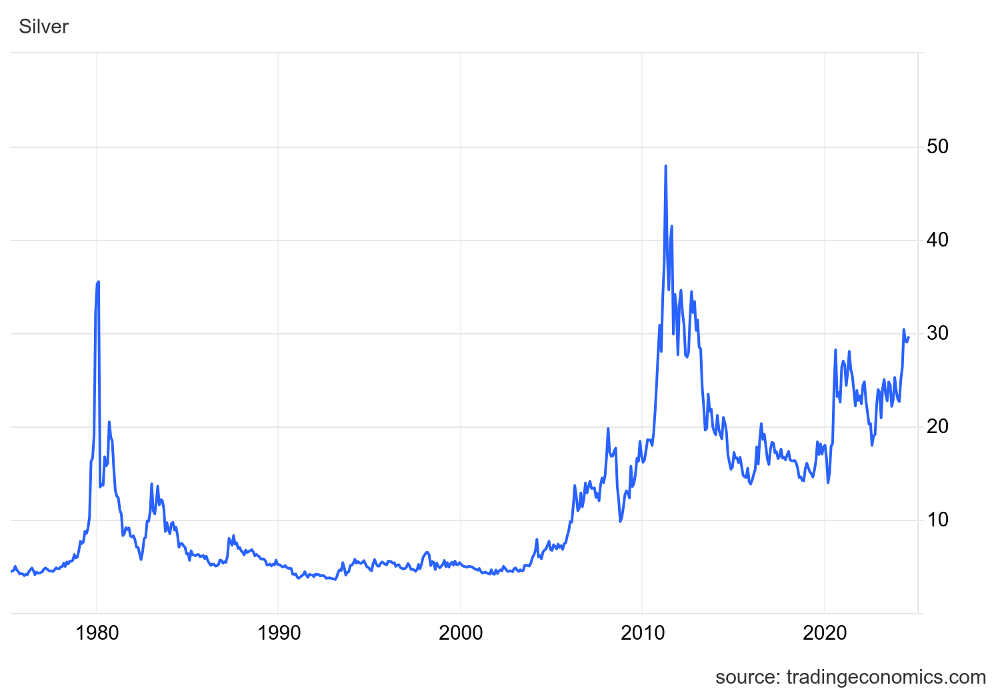

# Silver Price Tracker Module

A reusable React component for displaying real-time silver (XAG/USD) prices with multiple data source fallbacks, historical charts, and purchase tracking.



## Features

- **Live Silver Price** - Real-time XAG/USD spot price with auto-refresh
- **Multi-Source Fallback** - Automatically tries Finnhub → Polygon → Yahoo Finance
- **Historical Chart** - Interactive price history visualization using Recharts
- **Purchase Tracking** - Track silver purchases with profit/loss calculations
- **Rate Limiting** - Built-in protection against API abuse
- **Caching** - 60-second cache to reduce API calls
- **Responsive Design** - Works on all screen sizes

## Tech Stack

- React 18 + Vite
- Tailwind CSS + shadcn/ui
- Recharts for data visualization
- Supabase Edge Functions for API proxy
- TanStack Query for data fetching

## Quick Start

```bash
# Clone the repository
git clone https://github.com/J-Code-Sigma/silver-price-harvester.git
cd silver-price-harvester

# Install dependencies
npm install

# Start development server
npm run dev
```

## Project Structure

```
├── src/
│   ├── components/
│   │   ├── SilverPrice.jsx          # Main price display component
│   │   └── SilverHistoricalChart.jsx # Historical chart component
│   └── assets/
│       ├── silver-2024-bar.jpg
│       ├── silver-2024-coins.jpg
│       └── silver-divisible-2025.jpg
├── public/
│   └── data/
│       └── silver-prices.csv         # Historical price data
├── supabase/
│   └── functions/
│       └── get-silver-price/
│           └── index.ts              # Edge function for API proxy
└── SILVER_PRICE_MODULE.md            # Detailed module documentation
```

## Using in Another Project

See [SILVER_PRICE_MODULE.md](./SILVER_PRICE_MODULE.md) for detailed instructions on extracting and reusing this module.

### Quick Integration

1. Copy the required files (components, edge function, assets)
2. Install dependencies: `@tanstack/react-query`, `recharts`, `lucide-react`
3. Set up Supabase secrets: `FINNHUB_API_KEY`, `POLYGON_API_KEY`
4. Update the edge function URL in `SilverPrice.jsx`

### Basic Usage

```jsx
import SilverPrice from './components/SilverPrice';

function App() {
  return <SilverPrice />;
}
```

### With Purchase Tracking

```jsx
const purchases = [
  { date: '2024-01-15', ounces: 10, pricePerOunce: 23.50 },
  { date: '2024-06-01', ounces: 5, pricePerOunce: 28.00 }
];

<SilverPrice purchases={purchases} />
```

## API Sources

| Source | Free Tier | Rate Limit |
|--------|-----------|------------|
| Finnhub | Yes | 60 calls/min |
| Polygon | Yes | 5 calls/min |
| Yahoo Finance | Yes (unofficial) | Varies |

## Environment Variables

The project uses Supabase for the backend. Required secrets (stored in Supabase, not in code):

- `FINNHUB_API_KEY` - Get from [finnhub.io](https://finnhub.io)
- `POLYGON_API_KEY` - Get from [polygon.io](https://polygon.io)

## Development

```bash
# Run development server
npm run dev

# Build for production
npm run build

# Preview production build
npm run preview
```

## Security Notes

✅ **Safe for Open Source:**
- API keys are stored as Supabase secrets (not in code)
- `.env` only contains publishable/public keys
- No sensitive data exposed in frontend code
- Edge function proxies API calls securely

## License

MIT License - Feel free to use, modify, and distribute.

## Contributing

Contributions are welcome! Please feel free to submit a Pull Request.

---

**URL**: https://run.gptengineer.app/projects/8c4595ea-ad13-4471-8db5-aed572bc2d15/improve
